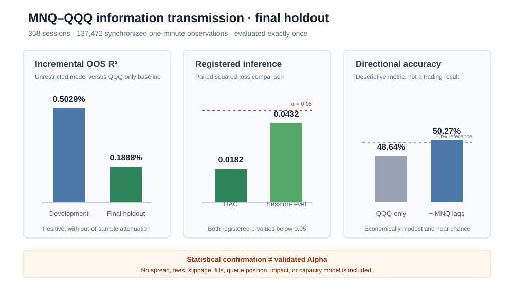
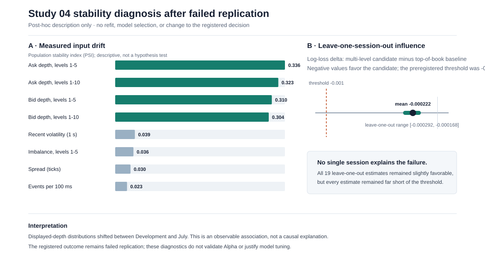
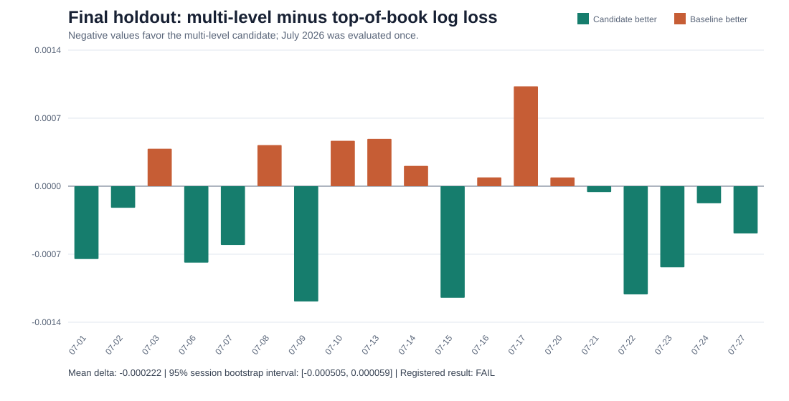

# Quantitative Market Research

[](https://github.com/wenwenjiang-lab/quant-research/actions/workflows/tests.yml)
[](https://www.python.org/)
[](LICENSE)

> **Status: active research portfolio.** Registered studies may be complete,
> but this repository does not claim validated alpha or a deployable strategy.

Start with the concise [`research portfolio summary`](reports/executive_summary.md)
or the plain-English [`research walkthrough`](reports/research_walkthrough.md).
Study 01 produced a registered negative forecasting result and kept its final
holdout sealed. Study 02 confirmed a small MNQ–QQQ information-transmission
effect in a single-use holdout. Neither result is presented as validated Alpha
or a deployable strategy.

Study 03 is a prospective, cost-aware economic-relevance protocol. It has not
started and contains no performance result. Its role is to test whether a
frozen signal survives executable delay, commissions, spread, and slippage on
a newly protected sample without reopening either completed holdout.

Study 04 is a completed market-microstructure replication study. Ten-level MNQ
order-book features passed Development validation but failed the prespecified
July final-holdout threshold. The negative decision is reported without
retuning and without an Alpha or profitability claim.

## Study registry

| Study | Research question | Registered disposition |
|---|---|---|
| STUDY-01 | Opening-range features for same-session volatility | Closed negative result; final holdout remains sealed |
| STUDY-02 | MNQ-to-QQQ one-minute information transmission | Closed statistical confirmation; not validated Alpha |
| STUDY-03 | Prospective cost-aware economic relevance | Preregistered; not started; 0/343 new sessions |
| STUDY-04 | Order-book depth for one-second price direction | Closed failed replication; no retuning |

The auditable [`study registry`](reports/study_registry.md) links every question,
sample boundary, protocol, holdout state, decision, and primary evidence file.
Its machine-readable source is [`configs/study_registry.toml`](configs/study_registry.toml).

This repository develops a reproducible empirical-research workflow for liquid
futures and ETFs. The first study examines opening-range behavior in Micro
E-mini Nasdaq-100 futures (MNQ). MNQ is the initial test case; the research
design is intended to extend to NQ, ES, QQQ, SPY, and related instruments.

The emphasis is on falsifiable hypotheses, reliable market-data construction,
leakage-resistant validation, statistical uncertainty, and clear reporting of
negative or inconclusive evidence.

## Run without market data

Exercise the full forecasting path with deterministic synthetic data. This
validates software behavior only and does not reproduce or imply market results:

```bash
python -m src.synthetic_demo
```

## Study 01 — Opening Range Behavior in Nasdaq-100 Futures

**Question.** Are prespecified opening-range characteristics associated with
the direction or magnitude of the remainder of the same trading session?

**Primary unit of analysis.** One regular trading session.

**Research decision.** Phase I finds a positive but regime-sensitive descriptive
association that attenuates after controlling for lagged volatility. Phase II
then asks whether Opening Range features improve a pre-open volatility forecast.
They do not: the candidate has relative out-of-sample R² of -0.0401, worse QLIKE,
and improves only 3 of 12 walk-forward folds. The registered confirmation gate
is not passed, so the final holdout remains sealed. This is a completed negative
decision for the registered question, not validated alpha or a trading strategy.

The full hypotheses and limitations are in
[`research_questions.md`](research_questions.md). The methodology is in
[`reports/research_methodology.md`](reports/research_methodology.md), and the
current construction audit is in
[`reports/data_quality_report.md`](reports/data_quality_report.md). The
development-only model report is in
[`reports/development_analysis.md`](reports/development_analysis.md). The
Phase II forecasting protocol is in
[`reports/phase2_protocol.md`](reports/phase2_protocol.md). The
development-only feature audit is in
[`reports/phase2_data_quality.md`](reports/phase2_data_quality.md). The
development-period forecasting decision is documented in
[`reports/phase2_development_results.md`](reports/phase2_development_results.md). The
Phase I exploratory specification is in
[`configs/opening_range.toml`](configs/opening_range.toml), and the Phase II
specification is in
[`configs/phase2_forecasting.toml`](configs/phase2_forecasting.toml).

## Research architecture

```text
Licensed raw bars (local only)
        |
        v
Schema, timestamp, OHLCV and interval audits
        |
        v
Session construction and prespecified opening-range features
        |
        v
Session-level analytical panel
        |
        v
Development sample -> expanding-window validation -> untouched holdout
        |
        v
Effect sizes, uncertainty, multiplicity control and development-only robustness
checks—including robust slopes, influence removal, nonlinear form, trailing
volatility regimes, and contract-roll sensitivity
        |
        v
Registered gate fails -> stop research question and keep holdout sealed
```

## Implemented research controls

| Research risk | Control implemented in this repository |
|---|---|
| Ambiguous timestamps | Timezone-aware parsing and explicit New York conversion |
| Invalid observations | OHLC invariants, volume checks, duplicate and interval audits |
| Look-ahead leakage | Opening features and post-opening outcomes use disjoint intervals |
| Random time-series splitting | Chronological and expanding-window validation utilities |
| Multiple comparisons | Holm family-wise p-value adjustment |
| Overstated conclusions | Minimum-sample gate and explicit study-decision status |
| Restricted vendor data | Raw and processed observations excluded from version control |
| Publication integrity | CI checks relative links, SVG validity, and tracked-data policy |
| Post-hoc model search | Frozen confirmation gate and formal stop decision |
| Irreproducible licensed sample | Deterministic synthetic end-to-end demonstration |

## Repository structure

```text
quant-research/
├── .github/workflows/          # Continuous test validation
├── configs/
│   ├── opening_range.toml       # Phase I machine-readable specification
│   ├── phase2_forecasting.toml  # Forecasting protocol and confirmation gate
│   ├── cross_asset_lead_lag.toml # Frozen MNQ–QQQ specification
│   └── economic_relevance.toml  # Prospective cost-aware protocol
├── data/
│   ├── README.md               # Provenance, schema and limitations
│   ├── raw/                    # Licensed source data; never committed
│   └── processed/              # Reproducible derived data; never committed
├── notebooks/                  # Thin exploratory/reporting notebooks
├── src/
│   ├── data_loader.py          # Typed OHLC ingestion and validation
│   ├── databento_loader.py      # Vendor normalization and RTH selection
│   ├── data_quality.py         # Structural market-data audit
│   ├── opening_range.py        # Opening-range calculation
│   ├── study_dataset.py        # Session-level feature/outcome panel
│   ├── statistical_tests.py    # Inference and multiplicity controls
│   ├── robustness_analysis.py  # Guarded development-only sensitivities
│   ├── forecast_features.py    # Point-in-time features and leakage audit
│   ├── forecast_validation.py  # Expanding-window folds and holdout guard
│   ├── forecast_models.py      # Baselines, losses and paired inference
│   ├── synthetic_demo.py       # Data-free end-to-end software demonstration
│   ├── cross_asset.py          # Point-in-time MNQ–QQQ panel construction
│   ├── cross_asset_models.py   # Restricted and unrestricted baselines
│   ├── cross_asset_evaluation.py # Walk-forward comparison and inference
│   ├── cross_asset_holdout.py  # Single-use holdout enforcement
│   ├── economic_relevance.py   # Point-in-time execution and cost model
│   ├── economic_validation.py  # Prospective splits and untouched holdout
│   ├── economic_evaluation.py  # Frozen net-performance decision metrics
│   ├── sample_registry.py      # Immutable local sample-boundary records
│   ├── protocol_audit.py       # Cross-field preregistration consistency
│   ├── study03_preflight.py    # Fail-closed protocol and sample start gate
│   ├── publication_integrity.py # Public links, figures and data-policy audit
│   └── validation.py           # Leakage-resistant time-series splits
├── reports/
│   ├── executive_summary.md    # Concise four-study portfolio overview
│   ├── cross_asset_protocol.md # Registered information-transmission design
│   ├── cross_asset_development_results.md # Development-only evidence
│   ├── cross_asset_final_results.md # Single-use holdout decision
│   ├── economic_relevance_protocol.md # Preregistered Study 03 design
│   └── research_methodology.md # Prespecified research standards
├── tests/                      # Deterministic synthetic-data tests
├── PORTFOLIO_ROADMAP.md
├── research_questions.md
├── pyproject.toml
└── requirements.txt
```

## Reproduce the test suite

```bash
python -m venv .venv
python -m pip install -e ".[dev]"
python -m pytest
```

Tests use synthetic fixtures only. No fabricated market observation is used as
an empirical result.

## Research principles

- Freeze primary definitions before inspecting the final holdout.
- Treat data construction as part of the statistical model.
- Report sample size, effect size, confidence interval, and failure periods.
- Prefer transparent baselines before complex machine-learning models.
- Distinguish statistical association from economic value after costs.
- Preserve negative and inconclusive findings.
- Do not describe a backtest as a production strategy.

## Study 02 — MNQ–QQQ Information Transmission

This independent study examines cross-asset information transmission between
Nasdaq futures and QQQ with synchronized timestamps, lead-lag controls, and a
separately protected evaluation sample.

The frozen protocol is versioned in
[`reports/cross_asset_protocol.md`](reports/cross_asset_protocol.md), with its
machine-readable specification in
[`configs/cross_asset_lead_lag.toml`](configs/cross_asset_lead_lag.toml).
The non-redistributive coverage audit is in
[`reports/cross_asset_data_quality.md`](reports/cross_asset_data_quality.md).
The leakage-safe development-panel audit is in
[`reports/cross_asset_development_panel.md`](reports/cross_asset_development_panel.md).
Development results are reported in
[`reports/cross_asset_development_results.md`](reports/cross_asset_development_results.md).
The registered model pair, information timing, allowed uses, and known
limitations are summarized in the
[`model card`](reports/cross_asset_model_card.md).
Lagged MNQ returns improve one-minute QQQ forecasts in the development sample,
but the improvement disappears when the one-minute lag is removed. This is
evidence of rapid information transmission, not validated Alpha or a trading
strategy. Licensed observations remain local. The final holdout was evaluated
exactly once and confirmed a smaller positive effect: 0.1888% incremental OOS
R² with paired-loss p = 0.0182 and session-level p = 0.0432.
The single-use holdout procedure is frozen in
[`reports/cross_asset_holdout_execution.md`](reports/cross_asset_holdout_execution.md),
and the final decision is reported in
[`reports/cross_asset_final_results.md`](reports/cross_asset_final_results.md).
The holdout is now permanently closed to retuning or repeat evaluation.



## Study 03 — Prospective Economic Relevance

The next study is preregistered but not executed. It separates statistical
predictability from economic value by freezing signal timing, next-bar
execution, transaction-cost stress tests, exposure constraints, chronological
validation, and a single-use future holdout. The completed Study 02 holdout is
explicitly unavailable for tuning or confirmation.

See the [`prospective protocol`](reports/economic_relevance_protocol.md) and
its [`machine-readable specification`](configs/economic_relevance.toml).
The minimum prospective sample is **343 sessions strictly after 2026-07-29**:
274 development sessions and a separately reserved 69-session final holdout.
The current readiness state is **0/343**, so empirical development is blocked.

Software-only execution, validation, and evaluation primitives are implemented
in [`src/economic_relevance.py`](src/economic_relevance.py),
[`src/economic_validation.py`](src/economic_validation.py), and
[`src/economic_evaluation.py`](src/economic_evaluation.py). They are validated
entirely with deterministic synthetic fixtures. No Study 03 market outcome has
been inspected and no empirical result has been produced.

## Study 04 — Market Microstructure Replication

This completed study asks whether five- and ten-level MNQ order-book features
improve one-second midpoint-direction forecasts beyond transparent market-state
and top-of-book baselines. It audits approximately 291 million licensed CME
Globex MBP-10 updates across 62 sessions while keeping raw and derived market
data outside version control.

The multi-level candidate passed chronological Development validation, but its
incremental log-loss improvement attenuated from 0.001738 in Development to
0.000222 in the one-time July holdout. It improved 11 of 19 holdout sessions,
but the session bootstrap interval crossed zero and the frozen replication
threshold was not met. The registered conclusion is **non-replication**—not
validated Alpha, profitability, or a deployable trading strategy.

See the complete
[`market-microstructure holdout report`](reports/market_microstructure_holdout.md),
including the data contract, model ladder, quality controls, uncertainty,
procedural disclosure, limitations, and final research disposition.
The post-hoc
[`stability diagnosis`](reports/market_microstructure_stability.md) documents
measured input drift and session influence without refitting the model or
changing the failed replication decision.





## Disclaimer

Research and educational use only. Nothing in this repository is investment
advice or evidence of guaranteed performance.
