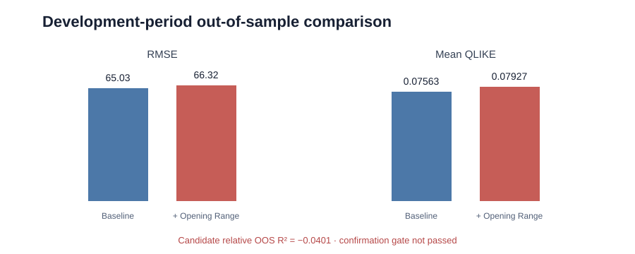
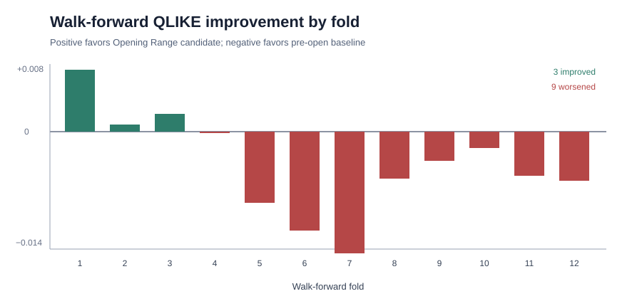

# Research Portfolio Summary

This portfolio contains three completed empirical studies of Nasdaq market
behavior and one preregistered prospective study. The completed work spans
one-minute bars and ten-level order-book events, with licensed observations
kept outside version control. The research uses point-in-time feature
construction, chronological validation, dependence-aware inference, and
explicit decision rules. None of the studies is presented as a deployable
trading strategy.

## Evidence at a glance

| Study | Research question | Validation decision | Interpretation |
|---|---|---|---|
| Opening Range Behavior | Do 09:30–10:00 MNQ features improve forecasts of 10:00–16:00 price variation? | Development gate failed; final holdout remained sealed | Negative result for the registered forecasting question |
| MNQ–QQQ Information Transmission | Do lagged MNQ returns improve one-minute QQQ forecasts beyond QQQ's own lags? | Single-use final holdout passed the frozen statistical rule | Small, short-lived predictive relationship; not validated Alpha |
| Prospective Economic Relevance | Can a frozen MNQ–QQQ signal retain net economic value under explicit execution costs? | Not started; preflight gate is closed at 0/343 new sessions | Preregistered protocol only; no empirical result or Alpha claim |
| Order-Book Depth | Do deeper MNQ book features improve one-second midpoint-direction forecasts beyond top-of-book information? | Development gate passed; single-use final holdout failed the frozen replication threshold | Favorable but attenuated holdout estimate; no stable Alpha or trading claim |

## Study 01 — Opening Range Behavior

### Design

The study validates 2,549,259 licensed MNQ one-minute observations and
constructs 1,255 development sessions from 2019-05-07 through 2024-05-23.
Predictors are timestamp-audited at 10:00 New York time. Evaluation uses
expanding windows, 63-session test blocks, a one-session embargo, QLIKE, and
HAC-aware paired inference.

| Metric | Baseline | Baseline + Opening Range |
|---|---:|---:|
| RMSE | 65.0295 | 66.3212 |
| QLIKE | 0.07563 | 0.07927 |
| Relative OOS R² | — | -0.0401 |

Only 3 of 12 folds improve. Candidate-minus-baseline QLIKE is 0.00364
(Newey–West SE 0.00212; two-sided p = 0.086), where positive favors the
baseline. The confirmation gate is not passed. The final holdout beginning
2024-05-24 remains sealed.

## Study 02 — MNQ–QQQ Information Transmission

### Design

The second study synchronizes MNQ futures and QQQ ETF returns at one-minute
frequency. The restricted model uses QQQ's own lags; the unrestricted model
adds MNQ lags 1–5. All model choices, the development gate, and the final
confirmation rule were frozen before the protected sample was opened.

The final holdout contains 358 sessions and 137,472 synchronized observations.
It was evaluated exactly once.

| Holdout metric | Result |
|---|---:|
| Incremental OOS R² | 0.1888% |
| HAC paired-loss p-value | 0.0182 |
| Session-aggregated p-value | 0.0432 |
| Restricted directional accuracy | 48.64% |
| Unrestricted directional accuracy | 50.27% |

The frozen statistical confirmation rule is satisfied. The effect is smaller
than in development and disappears in the registered latency sensitivity when
the one-minute MNQ lag is removed. This supports a narrow interpretation of
rapid information transmission. It does not establish executable Alpha:
spread, fees, slippage, fills, queue position, market impact, and capacity are
not modeled.

## Study 03 — Prospective Economic Relevance

Study 03 is a preregistered follow-up designed to test whether the narrow
MNQ–QQQ forecasting relationship can retain economic relevance after frozen
assumptions for spread, fees, slippage, latency, and turnover. Empirical
development has **not started**. The fail-closed preflight gate currently
records **0 of 343 required genuinely new sessions** after 2026-07-29: 274 are
reserved for chronological development and 69 for a single-use final holdout.

The protocol, sample boundary, validation design, decision rule, and
machine-readable consistency audit were frozen before collecting the new
sample. No Study 03 market outcome, forecast, P&L, or holdout result has been
accessed. This section documents prospective research governance; it is not a
third completed empirical study, a trading strategy, or evidence of Alpha.

## Study 04 — Order-Book Depth and One-Second Price Direction

The fourth study asks whether five- and ten-level MNQ limit-order-book features
improve one-second midpoint-direction forecasts beyond market-state controls
and top-of-book information. It uses licensed Databento CME Globex MDP 3.0
`mbp-10` events, end-labeled 100-millisecond book states, one-second decision
timestamps, chronological Development validation, and a single-use July 2026
holdout.

The multi-level model passed the Development gate but failed the registered
holdout replication threshold. Candidate-minus-baseline holdout log loss was
-0.000222, with 11 of 19 session wins and a session-bootstrap 95% interval of
[-0.000505, 0.000059]. The favorable point estimate was approximately 13% of
the Development improvement and its interval crossed zero. The study is closed
without retuning and makes no Alpha, profitability, causality, or deployability
claim. Full results are in the
[`market microstructure holdout report`](market_microstructure_holdout.md).

## What the portfolio demonstrates

- research questions converted into frozen, machine-readable specifications;
- licensed-data governance without redistributing vendor observations;
- futures contract-roll and cross-venue timestamp alignment;
- leakage-resistant feature formation and expanding-window evaluation;
- transparent baselines before model complexity;
- HAC and session-level inference for dependent observations;
- acceptance of a negative result and a permanently locked final holdout;
- separation of statistical evidence from economic or trading claims.

Detailed protocols, audits, results, limitations, and reproducible synthetic
tests are linked from the repository [`README`](../README.md). The registered
MNQ–QQQ model pair and its governance boundaries are condensed in the
[`model card`](cross_asset_model_card.md).
